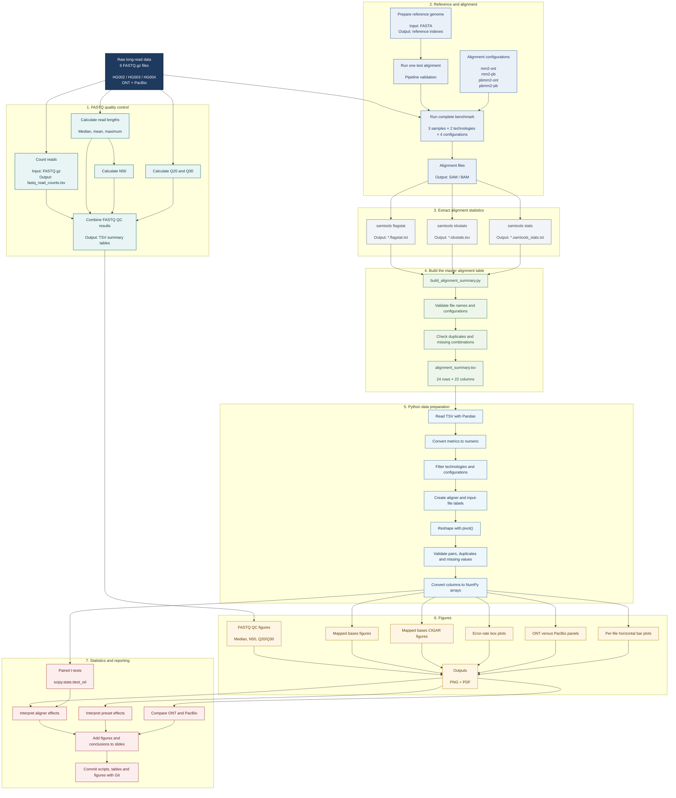

# Project Workflow

## End-to-end flowchart



## Stage 1 — Raw inputs

Six compressed FASTQ files:

```text
HG002.ont.1k.fastq.gz
HG002.pb.1k.fastq.gz
HG003.ont.1k.fastq.gz
HG003.pb.1k.fastq.gz
HG004.ont.1k.fastq.gz
HG004.pb.1k.fastq.gz
```

Each file contains 1,000 reads.

## Stage 2 — FASTQ quality control

The first analysis stage produced:

- read count
- read-length distribution
- median read length
- average read length
- maximum read length
- N50
- Q20 percentage
- Q30 percentage

## Stage 3 — Reference and alignment

The reference FASTA was prepared before alignment. A single test alignment was used to validate the pipeline before running the full benchmark.

### Tested configurations

| Project label | Aligner | Preset/settings |
|---|---|---|
| `mm2-ont` | minimap2 | `map-ont` |
| `mm2-pb` | minimap2 | `map-hifi` |
| `pbmm2-ont` | pbmm2 | `SUBREAD` |
| `pbmm2-pb` | pbmm2 | `CCS/HIFI` |

```text
3 samples × 2 technologies × 4 configurations = 24 alignments
```

## Stage 4 — Alignment statistics

For every alignment:

```text
*.flagstat.txt
*.idxstats.tsv
*.samtools_stats.txt
```

## Stage 5 — Master summary table

The script:

```text
alignment_analysis/scripts/build_alignment_summary.py
```

combines all reports into:

```text
alignment_analysis/tables/alignment_summary.tsv
```

The validated table contains 24 rows and 22 columns.

## Stage 6 — Python analysis and figures

The plotting scripts:

1. read the summary table,
2. convert metrics to numeric values,
3. filter technologies and configurations,
4. create labels,
5. reshape paired data,
6. validate duplicates and missing values,
7. generate PNG and PDF figures.

## Stage 7 — Statistics and reporting

Paired t-tests were used where the same biological samples were compared across configurations. Results were then interpreted and added to slides before being committed to Git.